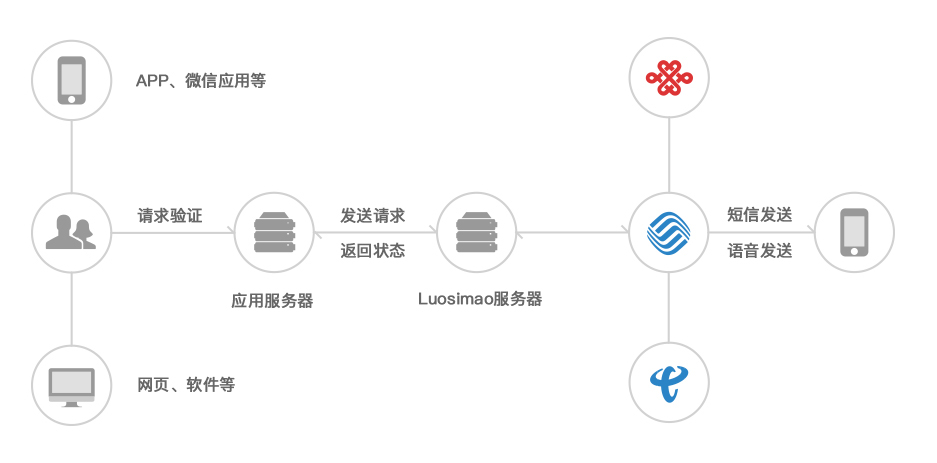

# BackEnd-SMS

## 题目简介

实现短信息服务（SMS），即qsc一面二面通知短信自动发送功能。

## 阅前须知

- 本题体量较大，故按学习报告完成情况给分
- 要求在github上建立项目，并建立文档
- 基于服务实现过程写一份Markdown学习报告，并附上项目地址
- 本题本质上就是短信通知系统的题目版，如对此题有任何疑问，请联系@烫立方

## 前置知识

- What is Git/Github
- What is Secure Shell(SSH)
- What is Markdown
- Any Language(Recommend Golang)
- Any DBMS(Recommend PostgreSQL)

## 参考文档

- [Git Documentation](https://git-scm.com/doc)

- [Git Tutorial](https://www.runoob.com/git/git-tutorial.html)

- [What is Secure Shell(SSH)](https://en.wikipedia.org/wiki/Secure_Shell)

- [Markdown Guide](https://www.markdownguide.org/basic-syntax/)

- [Markdown Tutorial](https://www.runoob.com/markdown/md-tutorial.html)

- [The Little Go Book](./TheLittleGoBook.pdf)

- [PostgreSQL Documentation](https://www.postgresql.org/docs/current/)

## 逻辑指引

### 输入输出

输入：调用者会给出目标的姓名与短信判断（如同通过面试或没通过面试，面试时间段编号等）

输出：正确的将短信信息发送到目标登记手机号

### 运营商交互
首先，短信功能是受运营商管控的，我们不可能手动搭建信息基站来进行短信发送；其次运营商并不会直接与我们社团打交道，而是介由中间公司提供的服务来进行的。

与中间公司交互，就要调用他们已经给出的API，并遵守他们的业务逻辑。
由于短信中不能具有违法内容，故将短信抽象为由模板与占位符组成的，模板首先要提交公司进行审核才能使用，占位符用于后期提供姓名、时间段等变动信息。
API的交互是介由网络实现的，因此还存在身份认证、信息传输格式、错误码等信息。

### 数据库调用

输入给出的信息仅用于锁定目标，并无完整的信息发送一条短信，故需要以输入信息为索引，从数据库中寻找更多的个人信息。

### 说明文档编写

你的代码写出来并不是单纯给自己看的，项目在很多时候是多人协作的，你要让协作者知道你干了什么，提供了什么函数，具体的逻辑是什么样的，每个板块实现了什么操作。这些东西不仅通过注释，也要通过良好的说明文档来实现。

且项目具有上下游，你写的函数需要由下游ROP的开发者调用，你需要给出调用格式与说明。

### RPC微服务

你所编写的SMS服务本质上还是要由其他开发者调用来使用的，也就是说，本质上是提供了一些抽象程度更高的函数，但是，SMS服务可能与调用者部署在不同的服务器上，常规的服务调用在本机实现，而跨服务器调用服务则需要使用到RPC。

### 需求文档
||功能需求|备注|
|:-:|:-:|:-:|
|短信添加|对不同类型短信进行命名||
|短信删除|删除‘已保存’或‘审核通过’短信模板|对于审核通过的短信： 若未确认发送则内容作废 若已完成发送则提醒是否新建短信重新提醒|
|短信审核|对‘已保存’的短信进行审核|完成审核后**一定时间**自动发送|
|短信排序|根据‘短信状态’‘短信名称’‘最近更新’进行排序 直观呈现给管理者短信的状态|默认状态为‘最近更新’‘降序排序’ 排序方式‘降序’‘升序’‘复原’|
|短信搜索|输入关键词对短信进行搜索定位|执行搜索操作后，将短信按搜索相关度降序排序|

## 任务清单

- 选择一个DBMS，构建报名者信息数据库
    - 可以仅包含发送短信所需的所有信息
    - 熟悉SQL操作
    - 熟悉所选语言提供的DBMS调用接口（一般语言为了方便进行数据区操作，会有一些库专门写了些方便的接口）
- 设计函数与接口
    - 提供给其他开发者调用的接口
    - 自定义函数的逻辑图
- 实现需求文档内的功能需求（假设模板在本地）
- 基于[API实例](https://luosimao.com/docs/api/)，在本地复现其SDK架构
    - 其中关于账户信息的API不用复现
    - 计算机网络结构初步
    - 所选语言对网络请求的处理模式
- 实现与运营商交互的逻辑
    - 要求：无需在公司页面上进行GUI操作
    - 登陆逻辑
    - 模板操作逻辑
    - 个人信息逻辑不要求
- 实现可能的错误处理逻辑
- 实现可能的日志输出逻辑
- 基于RPC重构提供函数
- 编写说明文档

## 总结反思

你或许可以同我们探讨一下（在学习文档里）
- 你觉得解决这个任务的过程有意思吗？
- 你在网上找到了哪些资料供你学习？
- 你觉得去哪里/用什么方式搜索可以比较有效的获得自己想要的资料？
- 在过程中，你遇到最大的困难是什么？你是怎么解决的？

以上。